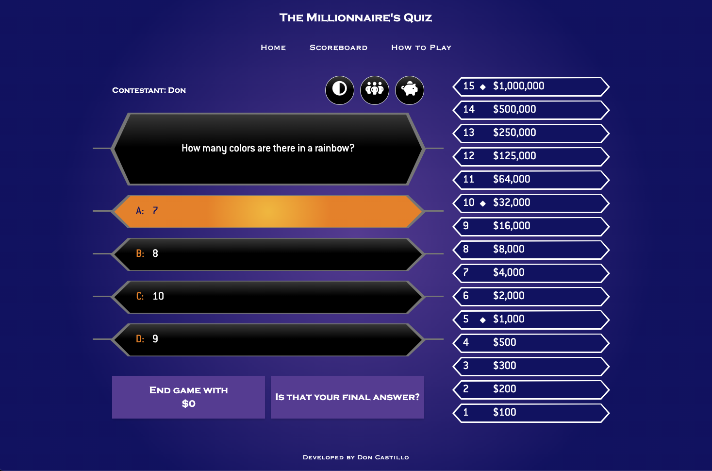

# The Millionaire's Quiz App

The Millionaire's Quiz App was inspired by the game show Who Wants to be a Millionaire. The app is built on the following stack and technology

* Svelte Framework
* Typescript
* Tailwind CSS
* MongoDB API (stores the user scores)
* Open Trivia API (provides the questions)
* PigLatin API (translates english to piglatin language)
* Axios API (to make network requests)
* Moment API (normalize date formatting)

URL: https://the-millionaires-quiz.netlify.app/  
Assignment description: <a href="docs/3720-Assignment2.pdf">here</a> 

## Running the app locally
`npm i` to install the packages and dependencies  
`npm run dev` to run in development mode  
`npm run dev -- --open` to start the server and open the app in a new browser tab  
`npm run build` to create a production version of your app  
`npm run preview` to preview the production build

## Screenshots

